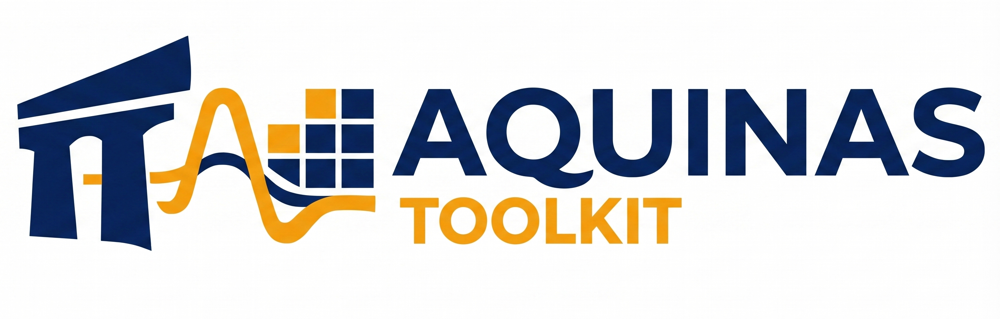
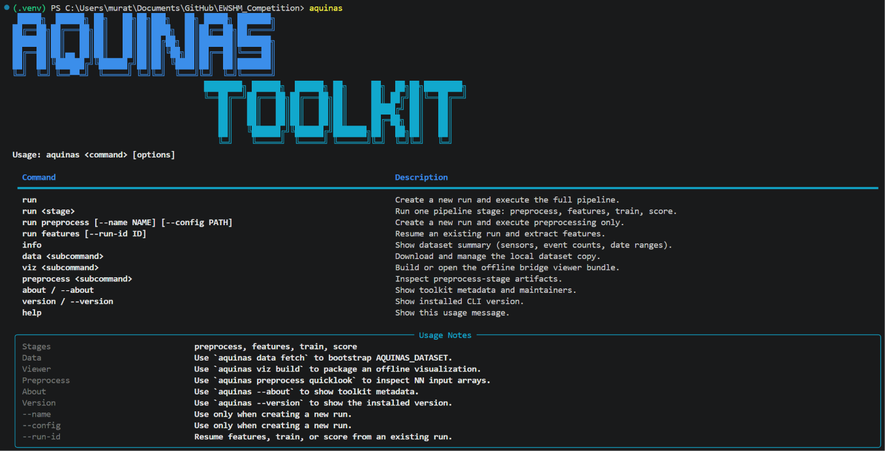

<p align="center">
  
</p>

<h1 align="center">AQUINAS Toolkit — EWSHM 2026 Challenge</h1>

<p align="center">
  
  
  
</p>

<p align="center">
  Unsupervised, event-wise structural health monitoring for a prestressed
  concrete box-girder viaduct.<br/>
  Our entry for Challenge 1 of the
  <a href="https://www.ewshm2026.com/">13th European Workshop on Structural Health Monitoring (EWSHM 2026)</a>,
  sponsored by <a href="https://www.osmos-group.com/">OSMOS Group</a>.<br/>
</p>

<p align="center">
  <a href="#our-approach">Our approach</a> ·
  <a href="#the-aquinas-toolkit">The toolkit</a> ·
  <a href="#the-pipeline">Pipeline</a> ·
  <a href="#3d-bridge-viewer">3D viewer</a> ·
  <a href="#results">Results</a> ·
  <a href="#getting-started">Getting started</a> ·
  <a href="#repository-structure">Repository structure</a> ·
  <a href="#the-challenge">The challenge</a> ·
  <a href="#dataset">Dataset</a>
</p>

<p align="center">
  By Amir Zare Beiranvand, Liv Breivik, Mohsen Rezvani Alile, Murat Güven, Tommaso Panigati, and Zhenkun Li
</p>

---

## Our approach

We derive a **data-driven, unsupervised health score** for the viaduct from its
traffic-induced strain and acceleration response, recorded over five monitoring
periods between July 2022 and June 2024. No labels are used, no numerical (FEM)
model is used, and everything runs on a standard office computer.

- **Event-wise analysis.** Raw records are grouped into vehicle-passing events by
  acquisition timestamp, so every strain and acceleration channel from the same
  passage is processed jointly and consistently.
- **Two complementary models**, both fit on **SET1 only** (the healthiest
  reference period, July 2022) and applied to SET2–SET5 **without re-fitting**:
  - a **transparent statistical baseline** — the median absolute Z-score of each
    event relative to the SET1 distribution, giving an interpretable benchmark;
  - an **attention-based autoencoder** that fuses **strain + acceleration +
    temperature** per sensor channel and treats **reconstruction error** as the
    health signal.
- **Synthetic health score.** Events are flagged against the **99th-percentile**
  of the SET1 error distribution. A window-level score combines the **frequency
  and severity** of threshold exceedances into a single bridge-level indicator.
  SET-level scores are **100 / 53 / 74.3 / 46.8 / 67** for SET1–SET5.
- **Key finding.** Flagged-event rate and reconstruction error rise as ambient
  temperature **falls** — SET4 (coldest, Jan 2024) is the most deviated, SET3
  (closest in season to SET1) the least. The gradual, temperature-tracking
  pattern points to **seasonal variability**, not an abrupt structural change,
  as the dominant driver of cross-period differences. The method still surfaces
  localized high-excitation events isolated to one side of the deck.

> 📄 Full methodology and results are in our two-page EWSHM 2026 Challenge
> report (see [`docs/`](docs/)).

## The AQUINAS Toolkit

The **AQUINAS Toolkit** turns the approach above into a reproducible, offline
software package. A single CLI — `aquinas` — drives the whole workflow:

**Reproducible pipeline:** `preprocess → features → train → score`, with every
run snapshotted to a timestamped folder (config, metadata, per-stage status), so
results are repeatable and auditable.

<p align="center">
  
</p>

Alongside the pipeline, the toolkit ships an **offline 3D bridge viewer**, a
tested Python API (`AquinasReader`, plotting helpers), and a notebook storyline
(01–05) that documents preprocessing, feature extraction, anomaly detection, and
the final health-score interpretation.

## The pipeline

Four stages, each a CLI subcommand, chained `preprocess → features → train → score`:

| Stage | What it does |
|---|---|
| `preprocess` | Group events, screen bad channels, then **signal-specific filtering → zeroing → alignment**. Strain is left unfiltered (baseline-corrected only); ACC_Z gets a zero-phase Butterworth band-pass (0.5–20 Hz). Outputs a canonical SQLite store and NN-ready event tensors. |
| `features` | Per-sensor waveform/context features, configured-axis acceleration FDD, and mode-shape summaries, stored to SQLite. |
| `train` | Deterministic train/validation/test split indices and train-only normalization stats for the NN inputs. |
| `score` | Reconstruction-error anomaly detection and synthetic health-score synthesis (see notebooks 04/05). |

Screening drops horizontal acceleration (ACC_Y) and one sensor damaged between
SET3 and SET4, retaining **8 strain + 8 vertical-acceleration channels per deck**
grouped into 8 physical sensor channels — the basis for all model inputs.

Preprocessing follows organizer guidance (the `AQUINAS_Explorer.R` helper and
follow-up email). Full semantics, evidence, and config glossary:

- [aquinas_toolkit/preprocessing/README.md](aquinas_toolkit/preprocessing/README.md) — exact preprocessing semantics and artifacts
- [configs/README.md](configs/README.md) — config glossary and how to verify a run's settings
- [docs/README.md](docs/README.md) — organizer-email record and the damaged-sensor override

## 3D bridge viewer

An offline, interactive 3D viewer presents the report's findings spatially on the
viaduct geometry. Selecting a dataset (SET1–SET5) instantly updates:

- **Health score headline** — the autoencoder-derived SET-level score
  (100 / 53 / 74.3 / 46.8 / 67) displayed in a pinned sidebar card with a
  color-coded accent (green → amber → red with declining health).
- **Sensor glyphs colored by anomaly %** — each glyph on the 3D bridge is
  tinted by the baseline-model flagged-event rate for that SET, modality, and
  channel, using the same five-band color scale (consistent with report
  Figs. 3–4 and Table 2).
- **Secondary proxy metrics** — event count, mean range, mean value, mean
  duration, and mean temperature are selectable as alternative colorings.

The bridge renders a trapezoidal box-girder cross-section for the `OLD`
and `NEW` decks, with sensor glyphs placed on exterior surfaces and an
`ALL | ACC | STR` family toggle. Clicking a glyph opens the Sensor Analysis tab
(trend sparkline, homologous comparison, waveform preview).

<p align="center"></p>

Build and serve it:

```bash
aquinas viz build          # rebuild the static bundle for the active run
aquinas viz open           # serve locally and open in the default browser
```

See [aquinas_toolkit/visualization/README.md](aquinas_toolkit/visualization/README.md)
for the full UI reference.

## Results

Percentage of events flagged above the 99th-percentile SET1 threshold, per
modality, evaluated across all five periods (model + threshold fixed from SET1):

| Set | Period | Accelerometers (%) | Strain (%) | All (%) |
|---|---|---|---|---|
| SET1 | Jul 2022 | 1.00 | 1.00 | 1.00 |
| SET2 | Apr 2023 | 5.50 | 3.14 | 5.74 |
| SET3 | Aug 2023 | 3.15 | 2.60 | 3.53 |
| SET4 | Jan 2024 | 5.74 | 3.63 | **6.32** |
| SET5 | Jun 2024 | 3.92 | 3.49 | 4.19 |

**SET-level health scores** (100 = healthiest reference): **100 / 53 / 74.3 /
46.8 / 67** for SET1–SET5. SET4 (coldest) ranks as the most deviated period; the
ranking is stable across a broad range of threshold/severity parameters.

## Getting started

### 1. Install

```bash
git clone https://github.com/likemaestro/EWSHM_Competition.git
cd EWSHM_Competition
python -m venv .venv

.venv\Scripts\activate        # Windows
source .venv/bin/activate     # macOS / Linux

pip install -e .
```

Targets Python 3.11 or newer.

### 2. Bootstrap the dataset

```bash
aquinas data fetch            # download, verify SHA256, extract to AQUINAS_DATASET/
```

Use `aquinas data fetch --force` to replace a corrupted local copy. Manual
extraction into `AQUINAS_DATASET/AQUINAS_SET{1..5}_*/` is also supported.

### 3. Explore

```python
from aquinas_toolkit import AquinasReader, plot_waveform

reader = AquinasReader("AQUINAS_DATASET/AQUINAS_SET1_2022_07")
print(reader.summary())

meta, waveform = reader.read_record("NEW_S1_DO_MID_ACC_Z", row_index=0)
plot_waveform(waveform, title="Single event preview")
```

Then launch the notebooks (01–05 are the main storyline):

```bash
jupyter lab notebooks/
```

### 4. Run the pipeline

```bash
aquinas run                   # create a reproducible run and execute the full pipeline
aquinas run preprocess        # create a run and run one stage only
aquinas run features          # continue the latest run from the previous stage
aquinas info                  # dataset summary
aquinas help                  # full command reference
```

Stages are enforced in order (`preprocess → features → train → score`). New runs
use `configs/default.yaml` unless `--config PATH` is given; each run snapshots its
config and writes artifacts under `results/<run_id>/`. Downstream stages
(`features|train|score`) resolve `results/latest.json` or an explicit `--run-id`.
See `aquinas help` and [configs/README.md](configs/README.md) for the full flag
and config reference.

## Repository structure

```text
EWSHM_Competition/
│
├── aquinas_toolkit/          Core Python package
│   ├── io/                   Data I/O (AquinasReader, metadata loaders)
│   ├── cli/                  CLI commands (run/data/preprocess/viz/info)
│   ├── preprocessing/        Event grouping, filtering, zeroing, alignment, NN tensors
│   ├── feature_extraction/   Per-sensor features, acceleration FDD, mode shapes
│   ├── training/             Deterministic splits + train-only normalization stats
│   ├── models/               Attention autoencoder (SequenceAttentionAE) + training helpers
│   ├── scoring/              Reconstruction-error synthetic health score (notebooks 04/05)
│   ├── visualization/        Offline 3D bridge viewer (health-score mode)
│   └── utils/                Shared utilities (plotting, run management)
│
├── notebooks/                Exploration & presentation
│   ├── 01_sensor_overview.ipynb … 05_health_scoring.ipynb   Main storyline
│   ├── azrmirz_fncs/         NN training / cross-SET inference / outlier inspection
│   └── misc/                 Supporting analyses (A–H)
│
├── configs/                  Pipeline configuration (YAML)
├── docs/                     Challenge rules, dataset handbook, report, figures
├── tests/                    Pytest test suite
├── scripts/                  Supporting development/diagnostic scripts
├── results/                  Run outputs (git-ignored)
├── AQUINAS_DATASET/          Raw data (git-ignored, user-supplied)
├── pyproject.toml            Package metadata + `aquinas` CLI entry point
└── AGENTS.md                 Instructions for coding agents
```

Milestone release: [`v0.2.0`](https://github.com/likemaestro/EWSHM_Competition/releases/tag/v0.2.0)
— reader, dataset bootstrap, preprocessing, feature extraction, CLI run workflow,
NN input packaging, deterministic split preparation, and the offline viewer.
NN model fitting, reconstruction-error anomaly detection, and health-score
synthesis are delivered through notebooks 04/05 and the `azrmirz_fncs` scripts.

---

## The challenge

A prestressed concrete box-girder viaduct in France is monitored by **48 sensors**
(24 acceleration + 24 strain) sampling at **100 Hz**. Recordings are
trigger-based: each captures a few seconds of bridge response as a vehicle
crosses.

The goal is a **data-driven, unsupervised** algorithm that processes all 48
channels, detects trends/anomalies/shifts in structural behaviour, and produces a
**synthetic health score** indicating whether the bridge's mechanical response is
stable, improving, or degrading. No labels are provided, no FEM models may be
used, and it must run on a standard office computer.

## Dataset

The **AQUINAS Dataset** (Available QUantities INtended for Analysis and Science)
contains five monthly snapshots spanning two years:

| SET | Period | Folder |
|---|---|---|
| SET1 | July 2022 | `AQUINAS_SET1_2022_07` |
| SET2 | April 2023 | `AQUINAS_SET2_2023_04` |
| SET3 | August 2023 | `AQUINAS_SET3_2023_08` |
| SET4 | January 2024 | `AQUINAS_SET4_2024_01` |
| SET5 | June 2024 | `AQUINAS_SET5_2024_06` |

Each SET contains 48 JSON index tables and 48 sensor directories with raw
waveform files. See `AQUINAS_DATASET/README.md` and
`docs/sources/Aquinas-Dataset-Handbook.pdf` for full details.

## Evaluation criteria & timeline

| Weight | Criterion |
|---|---|
| 40% | Quality of scientific approach, presentation, and discussion |
| 40% | Quality of results and published code |
| 20% | Innovation and expected impact |

| Date | Milestone |
|---|---|
| 2026-03-02 | Dataset released |
| 2026-04-01 | Deadline for submitting questions to OSMOS |
| 2026-07-01 | Two-page methodology + results summary due |
| 2026-07-09 | Presentation during plenary session |

```text
 █████╗  ██████╗ ██╗   ██╗██╗███╗   ██╗ █████╗ ███████╗
██╔══██╗██╔═══██╗██║   ██║██║████╗  ██║██╔══██╗██╔════╝
███████║██║   ██║██║   ██║██║██╔██╗ ██║███████║███████╗
██╔══██║██║▄▄ ██║██║   ██║██║██║╚██╗██║██╔══██║╚════██║
██║  ██║╚██████╔╝╚██████╔╝██║██║ ╚████║██║  ██║███████║
╚═╝  ╚═╝ ╚══▀▀═╝  ╚═════╝ ╚═╝╚═╝  ╚═══╝╚═╝  ╚═╝╚══════╝
                                        ████████╗ ██████╗  ██████╗ ██╗     ██╗  ██╗██╗████████╗
                                        ╚══██╔══╝██╔═══██╗██╔═══██╗██║     ██║ ██╔╝██║╚══██╔══╝
                                           ██║   ██║   ██║██║   ██║██║     █████╔╝ ██║   ██║
                                           ██║   ██║   ██║██║   ██║██║     ██╔═██╗ ██║   ██║
                                           ██║   ╚██████╔╝╚██████╔╝███████╗██║  ██╗██║   ██║
                                           ╚═╝    ╚═════╝  ╚═════╝ ╚══════╝╚═╝  ╚═╝╚═╝   ╚═╝
```
